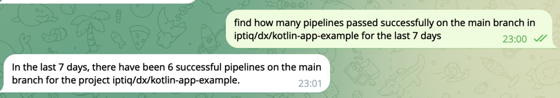
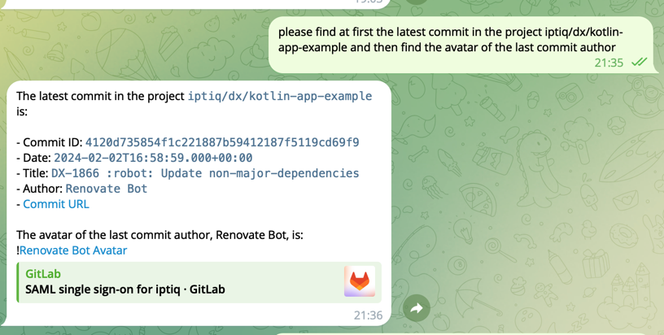

# HTTP request AI assistant

This project demonstrates how to make an AI assistant using [OpenAI assistants API](https://platform.openai.com/docs/api-reference/assistants) and integrate it with Telegram.

The bot can make any arbitrary call to any HTTP server using the natural language and giving some trust to the assistant.

Telegram is being used as an advanced chat platform.

You can find in the codebase that it contains all the [HTTP client configuration](bot/src/main/kotlin/io/github/artemptushkin/ai/assistants/gitlab/GitlabConfig.kt) to make it possible to integrate with, for example, Gitlab API.

All the HTTP request details as resolved by the OpenAI LLM and this server (bot) just executes anything it gets from the assistant. It's not needed to map the natural language with a given request - ChatGPT does it for you.

The solution is applicable to **any underlying HTTP request** assuming the assistant knows the API. You can teach it with the assistant instructions or rely on the public information it has been taught by OpenAI.

## Stack

* **Kotlin**
* **Spring Boot**
* **Telegram**
* **OpenAI assistants API**
* (example integration) **Gitlab**

## Example OpenAI assistant configuration

### Instructions

```text
You can help people with GitLab API requests which will be executed by the upstream service which is connected with you by the functions.

When you're asked to call a Gitlab API you generate the request and send all of its details (URL, headers, HTTP method, HTTP request body) as separate fields to function tools.

If it's a header and a value is dynamic or a reference you always send it between the symbols <>
You always send each header as I string, for example:
"headers": ["PRIVATE-TOKEN: <your_access_token>", "SOME-HEADER: value"]
```

Example expected actions input from the OpenAI assistant:

```json
{
  "url": "https://gitlab.com/api/v4/merge_requests",
  "method": "GET",
  "queries": "scope=assigned_to_me&state=opened",
  "headers": [
    "PRIVATE-TOKEN: <your_access_token>"
  ]
}
```

### Functions

* `http-request` - setting up the assistant will know in which structure it should define the request, consider it's as a contract, and you manage it with _instructions_.

```json
{
  "name": "http-request",
  "description": "call an arbitrary API",
  "parameters": {
    "type": "object",
    "properties": {
      "url": {
        "type": "string",
        "description": "full URL without query parameters"
      },
      "method": {
        "type": "string",
        "description": "Corresponding HTTP method for the request",
        "enum": [
          "GET",
          "POST"
        ]
      },
      "queries": {
        "type": "string",
        "description": "all the query parameters for the corresponding request"
      },
      "headers": {
        "type": "array",
        "description": "The set of headers required to do the request",
        "items": {
          "type": "string"
        }
      },
      "body": {
        "type": "string",
        "description": "The JSON request body required for the request"
      }
    },
    "required": [
      "url",
      "method"
    ]
  }
}
```
* `get-current-date` - so the bot doesn't have to make it up

```json
{
  "name": "get-current-date",
  "description": "Get current date",
  "parameters": {
    "type": "object",
    "properties": {},
    "required": []
  }
}
```

### Example dialog






## Integrations

* OpenAI, [api keys](https://platform.openai.com/docs/api-reference/authentication)
* Telegram, [bot token](https://core.telegram.org/bots/tutorial#obtain-your-bot-token)
* Gitlab, [personal access token](https://docs.gitlab.com/ee/user/profile/personal_access_tokens.html)
  * **Attention**. Please do not make your bot available for everyone with this token it's not secured. The Gitlab integration just demonstrates possibilities.

## Example application properties

```yaml
openai.apiKey: sk-vwrX05...
telegram.bot:
  token: 6713490000:AAEE-6JxdiAW...
  assistantId: asst_XYcPajR...
gitlab.token: glpat-KZofGC_Nan4...
```

You can populate the git ignored `application-secret.yml` file to store them locally, the `secret` profile is supposed to be enabled.

## Deployment

### Google cloud

#### Local run

https://cloud.google.com/docs/authentication/provide-credentials-adc#local-dev